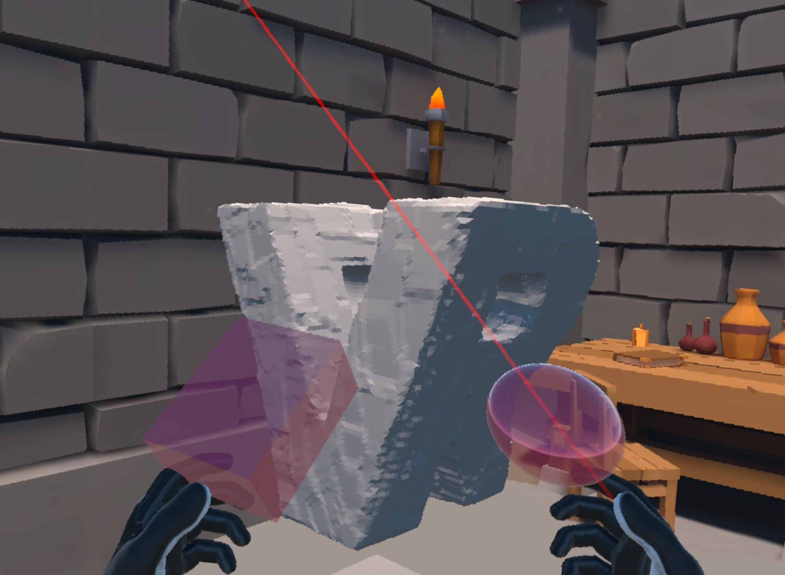

## Overview

VR Sculpture - project that gives users an opportunity to create sculptures in VR world. This project is mainly built
using [Voxel Art](https://assetstore.unity.com/packages/tools/modeling/voxel-art-264068) package.

Gameplay instructions can be found by the [link](GAMEPLAY.md).

## Requirements
- Unity version: 2022.3.21f1
- Pipeline: Universal RP
- Android for Oculus Quest 2

## Setup and Build

Steps to run and build the project:
- Clone the repository
- Open project in Unity Editor
- Import Voxel Art from Your assets (it is recommended to import into Assets/VoxelArt folder)
- Switch to Android and build with default settings. Project is set up to run on Oculus, however any other
XR plugin can be added if needed as the project doesn't require any Oculus specific API.

NOTE: Project doesn't come with free version of Voxel Art. It still needs to be purchased on [Unity Assets Store](https://assetstore.unity.com/packages/tools/modeling/voxel-art-264068).

## Plugins and third party SDKs
| Plugin name | Version | Link                                                                  |
|-------------|---------|-----------------------------------------------------------------------|
| Ultimate XR | 0.9.7   | https://github.com/VRMADA/ultimatexr-unity                            |
| UniTask     | 2.5.10  | https://github.com/Cysharp/UniTask                                    |
| VoxelArt    | 2.2.0   | https://assetstore.unity.com/packages/tools/modeling/voxel-art-264068 |