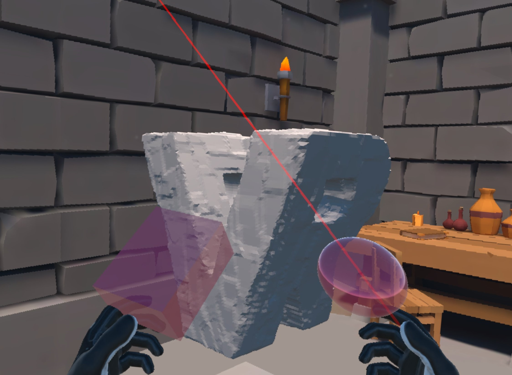

## Overview

VR Sculpture - project that gives users an opportunity to create sculptures in VR world.

Project was initially developed as a showcase to [Voxel Art](https://assetstore.unity.com/packages/tools/modeling/voxel-art-264068) package, however it was extended with more
complex features over time.

VR Sculpture allows user to create sculptures using controls on both hands, save create model on the cloud and load/update
it back in the future. Sculptures can only be saved for authenticated users. App also provides pre-made models that can be
used as a base for the sculpture.

Firebase is used as a backend for the project. It is used to authenticate users and store sculptures. Pre-made models are
loaded using Addressables.

Gameplay instructions can be found by the [link](GAMEPLAY.md).

## Requirements
- Unity version: 2022.3.21f1
- Pipeline: Universal RP
- Android for Oculus Quest 2

## Setup and Build

Steps to run and build the project:
- Clone the repository
- Open project in Unity Editor
- Import Voxel Art from Your assets (it is recommended to import into Assets/VoxelArt folder)
- Add Firebase configuration files according to the Firebase documentation.
- Switch to Android and build with default settings. Project is set up to run on Oculus, however any other
XR plugin can be added if needed as the project doesn't require any Oculus specific API.

NOTE: Project doesn't come with free version of Voxel Art. It still needs to be purchased on [Unity Assets Store](https://assetstore.unity.com/packages/tools/modeling/voxel-art-264068).

## Plugins and third party SDKs
| Plugin name | Version | Link                                                                  |
|-------------|---------|-----------------------------------------------------------------------|
| Ultimate XR | 0.9.7   | https://github.com/VRMADA/ultimatexr-unity                            |
| UniTask     | 2.5.10  | https://github.com/Cysharp/UniTask                                    |
| VoxelArt    | 2.2.1   | https://assetstore.unity.com/packages/tools/modeling/voxel-art-264068 |
| Firebase    | 12.6.0  | https://github.com/firebase/firebase-unity-sdk                        |